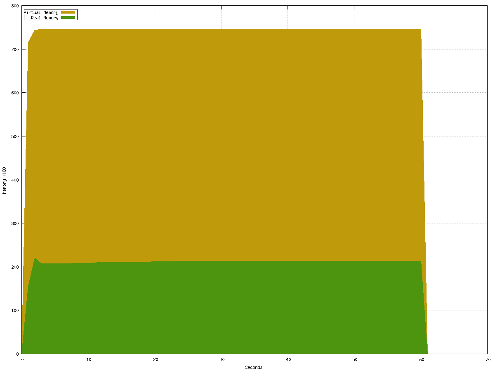

# Nim-Julia bridge 

This is repo is a WIP to be able to call Julia function from Nim using the C-API of Julia.

## Prerequisite

* Have Julia installed 
* Set the environment variable JULIA_PATH to the Julia installation folder 
* Run ``nimble install`` or ``nimble develop`` 

## Ressources

How to embed Julia w/ C :

* https://docs.julialang.org/en/v1/manual/embedding/index.html#Working-with-Arrays-1

* https://github.com/JuliaLang/julia/tree/master/test/embedding

* ``legacy/`` folder contains previous experiment and examples of wrapping in C. 

* ``tests/testfull.nim`` contains several test suite and examples

## Next steps 

* Improve function calling
  * Use `.()` / DotOperators for a syntax that looks more "native" when calling function
  * Find a solution for chaining Julia functions in one expression

* Improve Julia Arrays usage from Nim
  * Julia is mostly oriented towards numerical computing so Arrays are THE most important data structure to support
  * Handle row major vs column major transposition when using array
  * Implement alias to access common Julia function on the Array API (maybe in its own library ?)
  * map / apply / reduce /fold
  * Iterators

* Expand support for non-trivial / non-POD types for Arrays / Tuples / Dict
  * Add tests for nested types (Tuples containing Arrays or other Tuples etc.)

* Add a tag for tracing for Julia memory allocation

## Limitations

* Julia Init / Exit can only be called **once in the lifetime of your program**
* Value conversion Nim ==> Julia are done **by copy** except for Arrays-like type that use a pre-allocated buffer.
* Value conversion Julia => Nim s always done **by copy**
  * When using Arrays you can access the buffer as ``ptr UncheckedArray`` of the Julia Arrays with ``rawData()``. 
  * Using ``to(seq[T])`` or ``to(Tensor[T])`` perform a ``copyMem`` of ``jlArray.rawData()`` in your seq/Tensor 

* Julia allocated arrays only goes up to 3 dimensions (but Arrays can be allocated in Nim)
* Only supports Linux for now

# Examples

Here is the basic API usage : 
```nim
import nimjl

jlVmInit() # Initialize Julia VM. This should be done once in the lifetime of your program.

var myval = 4.0'f64
# Call Julia function "sqrt" and convert the result to a float
var res = jlCall("sqrt", myval).to(float64)
echo res # 2.0

jlVmExit() # Exit Julia VM. This can be done only once in the lifetime of your program.
```

Take a look at ``tests/testfull.nim`` and the ``examples/`` folder for  more examples. 

## Checking Memory Leak

The test ``tests/testleak.nim`` run the full tests suites (with multiple allocations in both Nim and Julia) continuously for 60 seconds.
At the end of each test, Julia's garbage collector is called manually and a bash script trace the graph of memory and virtual memory (Linux only).
This is to make sure that Julia's memory get cleaned up on exit and that there is on weird GC interaction that makes memory consumption increase over time when using the Julia VM.

If there is a simpler way to do this, feel free to open a PR ! 



# Documentation

Complete API documentation remains a TODO.
